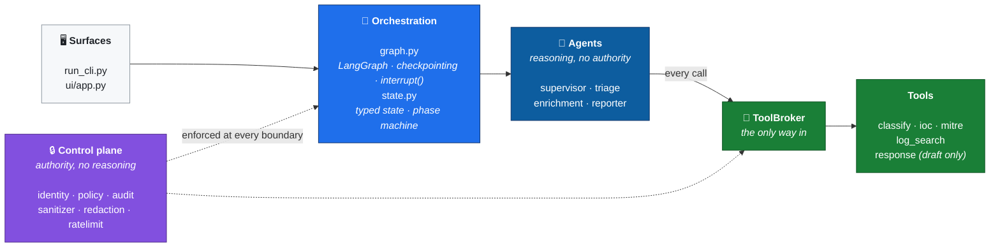
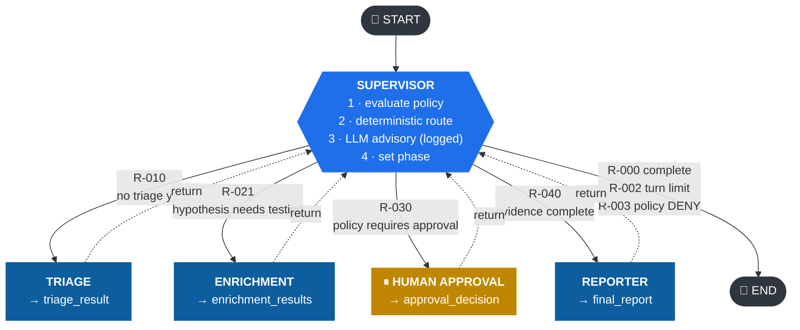
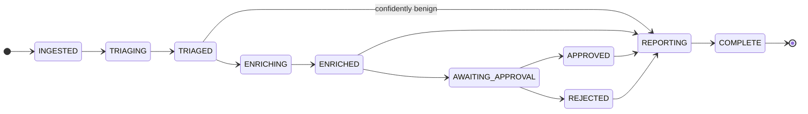
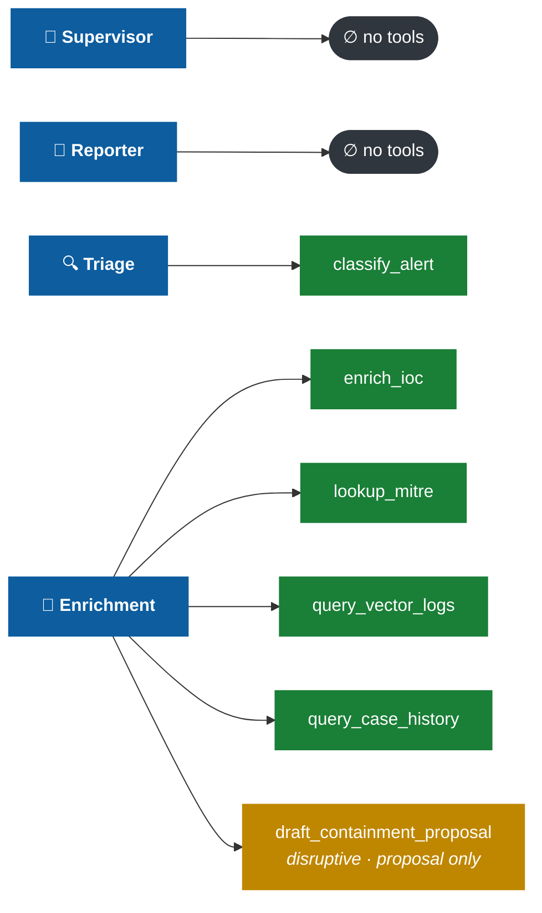
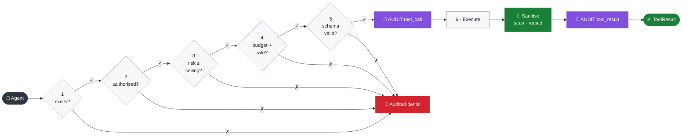

<div align="center">

# Architecture

**How the system is put together, and why each piece is shaped the way it is.**

[← Back to README](../README.md) · [Threat Model →](THREAT_MODEL.md)

</div>

---

## 1 · Design thesis

Most agent frameworks give a model a set of tools and let it decide what to do. That is a
reasonable default for a coding assistant and a poor one for a security tool, because it puts
the model in the position of **deciding whether a control applies to it**.

This project inverts that.

<div align="center">

### The model reasons. Code decides.

</div>

| Decision | Made by | Why |
|:--|:--|:--|
| Which agent runs next | 🔒 **Deterministic router** | Routing is control flow; a manipulated model must not be able to skip triage or the approval gate |
| Whether a human must approve | 🔒 **Deterministic policy engine** | The most security-critical decision in the system — it must not be persuadable |
| Which tool to call, with what arguments | 🔒 **Agent code** | Bounded, auditable, testable |
| Whether a principal *may* call that tool | 🔒 **Broker + identity registry** | Least privilege enforced in code, not prose |
| Severity, category, narrative, correlation | 🤖 LLM | Genuine judgement work, where a model adds real value |

The LLM *is* consulted about routing — its answer is recorded and compared with the router's.
When they disagree, the disagreement is logged as an **override**. This gives an auditor
something concrete: a record of every time the model wanted to do something other than what
policy dictated.

---

## 2 · Layered structure



> [!NOTE]
> The **control plane** (`src/security/`) contains no LLM calls whatsoever. Every module in it
> is a deterministic function of validated input. That is what makes its decisions testable
> and its behaviour reproducible.

---

## 3 · Graph topology



There are **no agent-to-agent edges**. Every specialist returns to the supervisor, so there is
exactly one place where *"what happens next"* is decided and exactly one place to audit it.

### Phase state machine



Transitions are validated at runtime (`src/state.py:validate_transition`). Illegal transitions
halt the run and are audited.

> [!IMPORTANT]
> Note what the machine makes **unrepresentable**: `AWAITING_APPROVAL` has no edge to
> `REPORTING` or `COMPLETE`. The only ways out are a recorded decision or a halt.
> Any phase can transition to `HALTED`.

---

## 4 · Least privilege — the capability matrix



Two asymmetries carry most of the security value:

- The **supervisor holds no tools.** Compromising the orchestrator yields no capability — it
  can only produce a logged routing disagreement.
- The **reporter holds no tools.** It reads every log line and intel note gathered during the
  run, making it the component most exposed to untrusted text — so it is given the least
  authority in the system.

---

## 5 · The tool broker

Every capability call passes through `ToolBroker.invoke()`, which applies six controls in a
fixed order:



Two details worth noting:

1. The invocation is audited **before** the handler runs, so a handler that hangs or crashes
   the process still leaves evidence that it was called.
2. Expected denials **never raise**. They come back as a failed `ToolResult`, so the agent can
   adapt *and* the denial is recorded rather than crashing the run.

Adding a tool means adding a `SOCTool` to the registry and granting it in the capability
matrix. It inherits every control automatically; the only way to get an unguarded tool is to
bypass the broker deliberately.

---

## 6 · Component map

```
src/
├── enums.py           Shared vocabulary (bottom of the import graph)
├── config.py          Settings; the only place the environment is read
├── state.py           Pydantic state, phase machine, invariants
├── graph.py           LangGraph assembly, checkpointing, HITL interrupt
├── llm.py             Ollama access, structured output, JSON fallback
├── ingest.py          Alert parsing — the system's trust boundary
├── run_cli.py         Command-line runner
│
├── security/          ── the control plane (no LLM calls) ──
│   ├── identity.py    Principals and the capability matrix
│   ├── policy.py      Deterministic HITL rules
│   ├── audit.py       Hash-chained tamper-evident audit log
│   ├── audit_sink.py  Where events land: fsync, rotation, off-host forwarding
│   ├── signing.py     Ed25519 record signing and chain-head anchoring
│   ├── approval_identity.py  Proxy-verified approver; fails closed
│   ├── authz.py       Human authority matrix, separation of duties, quorum
│   ├── sanitizer.py   Untrusted-content containment + injection heuristics
│   ├── redaction.py   Secret scrubbing (known values + patterns)
│   └── ratelimit.py   Token-bucket limiting
│
├── tools/             ── the capability surface ──
│   ├── base.py        SOCTool contract + guarded ToolBroker
│   ├── classify.py    Deterministic rule-based classifier
│   ├── ioc.py         Offline indicator reputation
│   ├── mitre.py       Offline ATT&CK lookup
│   ├── log_search.py  Semantic log search
│   └── response.py    Containment drafting (proposal only)
│
├── agents/
│   ├── base.py        Shared context, prompt hardening
│   ├── supervisor.py  Routing authority + LLM advisory
│   ├── triage.py      Classification with downgrade guardrail
│   ├── enrichment.py  Evidence gathering + proposal derivation
│   ├── reporter.py    Synthesis (zero tools, zero authority)
│   └── baseline.py    Single ReAct agent, kept for comparison
│
├── observability/     ── operations, NOT evidence ──
│   ├── telemetry.py   OTel setup + the closed attribute vocabulary
│   ├── metrics.py     Golden signals plus the security-specific ones
│   └── health.py      Readiness: critical vs degraded
│
├── memory/
│   └── case_store.py  Cross-run history: dedup, correlation, analyst decisions
│
├── ingest/            ── the trust boundary ──
│   ├── base.py        parse_alert: the one validator every source ends at
│   ├── files.py       Sample alerts and watched directories
│   └── siem.py        Elastic / Splunk / Sentinel polling adapters
│
├── rag/
│   ├── embeddings.py  TF-IDF (default) / Ollama backends
│   └── vectorstore.py ChromaDB index with in-memory fallback
│
└── ui/app.py          Streamlit dashboard + approval console
```

---

## 7 · Notable engineering decisions

<details open>
<summary><b>Deterministic fallbacks everywhere</b></summary>

<br/>

Every agent completes its job with the LLM switched off. This is not just for testing: it sets
a **floor below which the pipeline cannot degrade**. If Ollama dies mid-incident, triage still
classifies, enrichment still gathers evidence, and the report is still produced — labelled as
rule-based.

The test suite runs entirely in this mode, which means the security properties are verified
*independently of model behaviour*.

</details>

<details>
<summary><b>Two structured-output strategies</b></summary>

<br/>

Small local models fail LangChain's tool-calling path routinely, returning `None`.
`structured_completion()` tries tool-calling twice, then falls back to constrained JSON
decoding with an explicit field list and a worked example skeleton.

Passing the raw JSON Schema was tried first and made things *worse* — llama3.2 echoed the
schema document back instead of producing an instance of it. Both paths validate through
Pydantic before anything becomes state.

</details>

<details>
<summary><b>Containment proposals are derived by rule, not asked of the model</b></summary>

<br/>

*"Which host should we isolate"* is precisely the decision an attacker would most like to
influence. Proposals are derived from evidence by explicit rules in `enrichment.py`; the model
writes the analysis narrative instead.

</details>

<details>
<summary><b>Structural report facts are copied, not regenerated</b></summary>

<br/>

Verdict severity, technique list, proposal list and approval status are copied from validated
state into the report. The model writes prose around them but cannot quietly drop a proposal
or downgrade a severity in the write-up.

The timeline is likewise assembled in code from timestamped evidence — LLMs reorder and
hallucinate timestamps, and a wrong timeline is worse than no timeline.

</details>

<details>
<summary><b>Relevance floors on retrieval and ATT&CK mapping</b></summary>

<br/>

Early runs mapped a corporate-VPN false positive to *"Data Encrypted for Impact"* and put a
ransom-note log line in its timeline, because lexical search always returns *something*.

Both now have absolute score floors (`MIN_LOG_RELEVANCE`, and a keyword-score floor in
`lookup_mitre`). A spurious ATT&CK reference in a report reads as confirmed tradecraft, which
is worse than no mapping at all.

</details>

<details>
<summary><b>TF-IDF as the default embedding backend</b></summary>

<br/>

The default retriever is a fitted TF-IDF vectoriser, not a neural embedding model. It needs no
download, is byte-identical across machines, and keeps the demo fully offline.

**It is lexical, not semantic** — it matches *"powershell encoded command"* to a line
containing those terms, but will not match *"obfuscated script execution"* to the same line. In
practice agents query using vocabulary drawn from the alert itself, so this works well. Set
`SOC_EMBEDDING_BACKEND=ollama` with `nomic-embed-text` for genuine semantic recall.

</details>

<details>
<summary><b>Why an interrupt, not an approval tool</b></summary>

<br/>

In a ReAct loop, *"pause for a human"* is a tool the model may decline to call — the control an
auditor cares most about becomes the one most easily talked away.

`interrupt()` suspends graph execution itself. The process can exit and the container can
restart; the run resumes from the SQLite checkpoint when a human answers.

See `src/agents/baseline.py` for the full comparison against the single-agent design this
replaced.

</details>

---

## 8 · Baseline vs. supervisor

`src/agents/baseline.py` retains the single ReAct agent that was built first, so the two
designs can be compared directly.

| Property | Baseline ReAct agent | Supervisor architecture |
|:--|:--|:--|
| Control flow | Model decides every step | Deterministic router decides |
| Tool selection | Model picks freely | Code picks; broker authorises |
| Blast radius of an injection | Full tool set for the whole run | Per-agent least privilege; reporter holds nothing |
| Approval gate | A tool the model may decline to call | An interrupt outside the model's reach |
| Auditability | *"Agent called X, then Y"* | Phase transitions + policy decisions + routing rationale |
| Reproducibility | Varies run to run | Same route for the same state |

> [!IMPORTANT]
> The decisive problem is the approval gate. Moving it into graph structure, outside the
> model's reach, is what makes the pipeline defensible.

Even in the baseline, every tool call still goes through the guarded broker — so least
privilege, validation, rate limiting and audit all still apply. The baseline is *less
controlled*, not uncontrolled.
